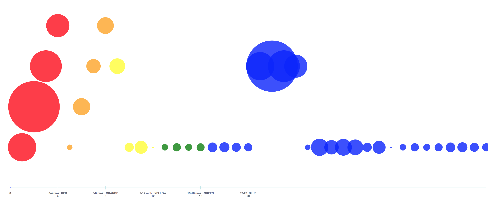

# A bubble chart visualization

Tried my hand in a Full Stack development using the power of javascript

## Exploring

* MySQL  
* NodeJS  
* React-Redux-Saga

## Getting started

This project has three parts - each having its own package.json

### 1 - Pushing the RAW data to a Local MySQL RDBMS database

* This happens using the code in Folder "rawDataUpload"
* In this folder, the JS file uploadJsonData.js has been used to push json data into a local MySQL database set up in my local

#### Steps to achieve 1

* Start MySQL in local
* Go to folder "rawDataUpload" in terminal
* run `npm i` in terminal
* run `node uploadJsonData.js` in terminal

### 2 - Pulling the tabular form data from Local MySQL RDBMS database and sending it as a response to HTTP get request `http://localhost:3000/`

* This happens using the code in Folder "processedDataDownload"
* In this folder, the JS file getRiskData.js has been used to host a service URL using Node JS
* This was done using Express Module

#### Steps to achieve 2

* Go to folder "processedDataDownload" in terminal
* run `npm i` in terminal
* run `node getRiskData.js` in terminal

### 3 - Hitting the service URL to get Risk data and showing it to USER using a Sensible visualization

* This happens using the code in Folder "riskSenseUI"
* In this folder, a Bubble/scatter plot has been created using "React", "Redux", and "redux saga"
* For Chart, a library in react  - called react vis developed by Uber is pushed
* basically, react has been used to built visualization where state is managed by Redux using store and API calls managed my Redux saga [ using generator functions]
* Even though, I have tried to follow the folder structure of react boiler, this app was created suing create react app
* Each container will have its own reducer, actions, selectors, constants
* This would ease the scalling up of the app in a smooth way

#### Steps to achieve 3

* Go to folder "riskSenseUI" in terminal
* run `npm i` in terminal
* run `npm start` in terminal

Happy Coding :)

